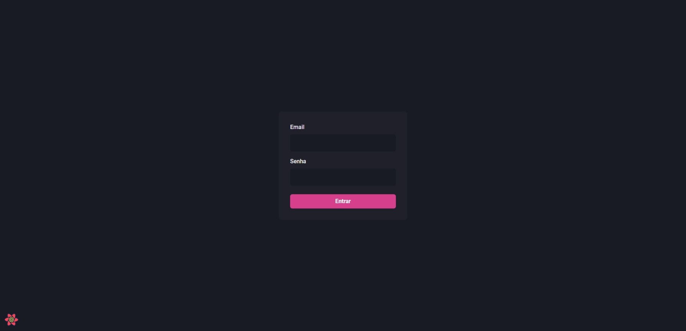
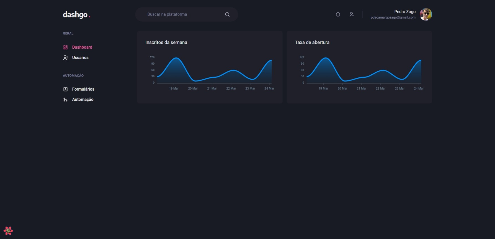
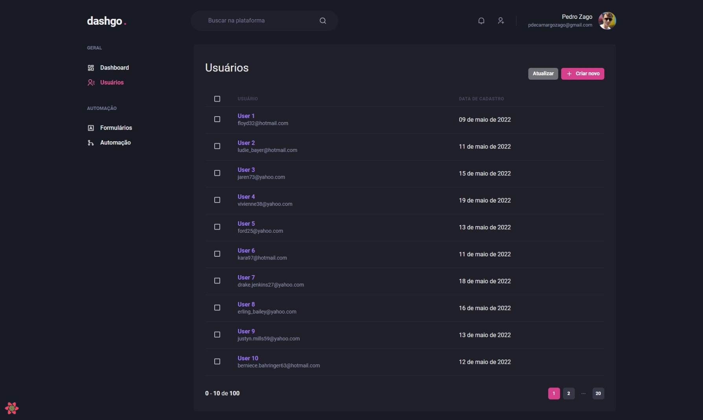
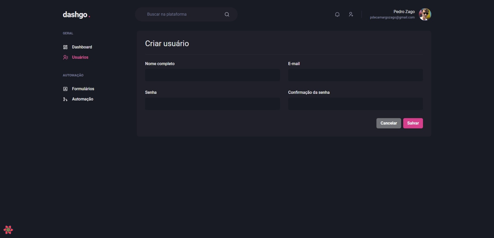

<h1 align="center">
     dashgo
</h1>

## 💻 Sobre o projeto

Projeto de um sistema totalmente responsivo utilizando Chakra UI, desenvolvido durante o **Ignite de ReactJS** oferecida pela [Rocketseat](https://www.rocketseat.com.br/ignite/).

---

## ⚙️ Funcionalidades

- [x] Dashboard;
- [x] Validação dos formulários;
- [x] Design resposivo;
- [x] Gráficos;
- [x] Data fetching e cache local;
- [x] Paginação da tabela.

---

## 🎨 Layout

<p align="center" style="display: flex; align-items: flex-start; justify-content: center;">
  
  
  
  
  
  
  
</p>

---

## 🚀 Como executar o projeto

### Pré-requisitos

Antes de começar, você vai precisar ter instalado em sua máquina as seguintes ferramentas:
[Git](https://git-scm.com), [Node.js](https://nodejs.org/en/). 
Além disto é bom ter um editor para trabalhar com o código como [VSCode](https://code.visualstudio.com/)

#### 🧭 Rodando a aplicação web (Frontend)

```bash
# Clone este repositório
$ git clone git@github.com:PedroZago/react-ignite-dashgo.git
# Acesse a pasta do projeto no seu terminal/cmd
$ cd react-ignite-dashgo
# Instale as dependências
$ yarn install
# Execute a aplicação em modo de desenvolvimento
$ yarn dev
# A aplicação será aberta na porta:3000 - acesse http://localhost:3000
```

---

## 🛠 Tecnologias

As seguintes ferramentas foram usadas na construção do projeto:

#### **Website**  ([React](https://reactjs.org/)  +  [TypeScript](https://www.typescriptlang.org/))

-   **[Chakra Ui](https://github.com/chakra-ui/chakra-ui)**
-   **[Emotionjs](https://github.com/emotion-js/emotion)**
-   **[Hook Form](https://react-hook-form.com/)**
-   **[Apex Charts](https://apexcharts.com/)**
-   **[Fakerjs](https://github.com/faker-js/faker)**
-   **[Miragejs](https://github.com/miragejs/miragejs)**

---

## 📝 Licença

Este projeto esta sobe a licença [MIT](./LICENSE).
